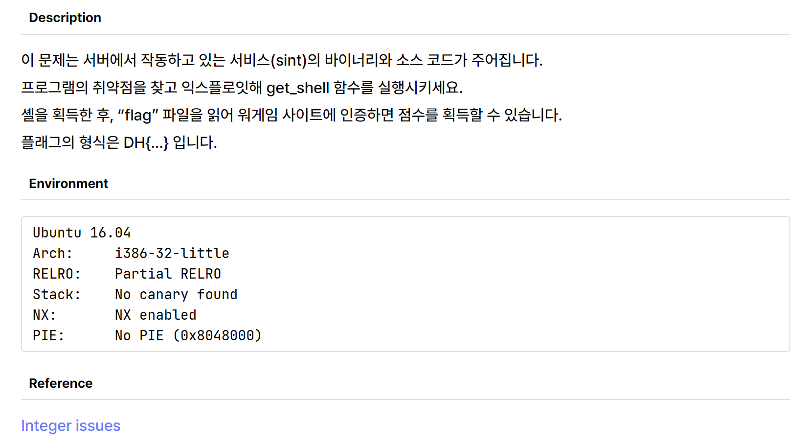

# 0x00 Overview 
- File được cho: `sint`, `sint.c`

# 0x01 Vulnerability
Do `NX enable`, `No canary found` kết hợp với việc có sẵn hàm `get_shell`, chúng ta sẽ giải quyết bài toán bằng phương pháp `ret2win`. 

Nhận thấy `buf` được khai báo 256 bytes, thông qua hàm `read`, để overwrite được `eip`, chúng ta phải sử dụng số byte nhiều hơn hoặc bằng `256 + 4 + 4 = 264` bytes.\ 
Do biến `size` chỉ có thể nhận được giá trị trong khoảng $[0, 256]$ nên sẽ không thực hiện được ý tưởng đó một cách thông thường. 

Chúng ta cùng tìm hiểu sơ qua về cấu trúc của hàm `read`
```c
ssize_t read(int fd, void buf[.count], size_t count);
```

trong đó, biến `count` có kiểu dữ liệu là `size_t`. Nghĩa là đối với file 32 bits, `size_t ~ unsigned int` hay đối với file 64 bits, `size_t ~ unsigned long long`. Tóm lại, biến `count` phải là số không dấu.\ 
Nếu `count` là một số âm, chuyển đổi ngầm định giữa `int` và `size_t` xảy ra. Giả sử file thực thi là 32 bits, `count = -1`, sau khi chuyển đổi ngầm định, `count` sẽ có giá trị là $2^{32} - 1$

Từ ý tưởng đó, chúng ta có thể thỏa sức overwrite `eip`. 

# 0x02 Reference
- [DreamHack - Integer issues](https://learn.dreamhack.io/12#11)
- [read](https://man7.org/linux/man-pages/man2/read.2.html)