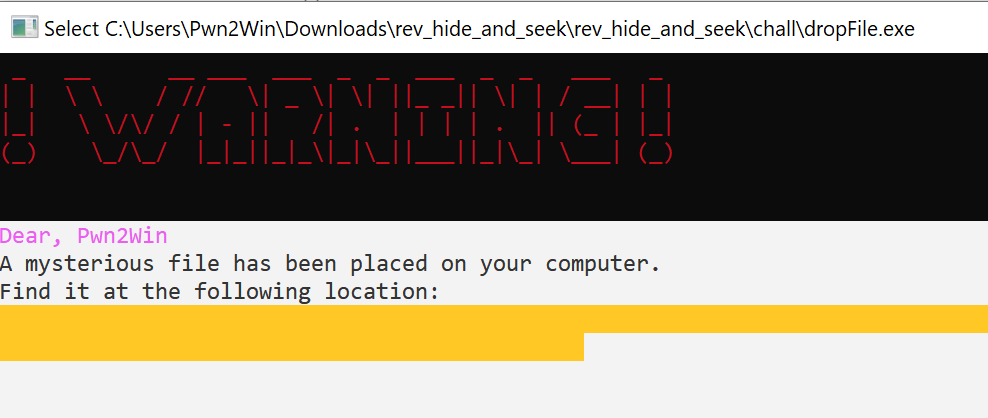
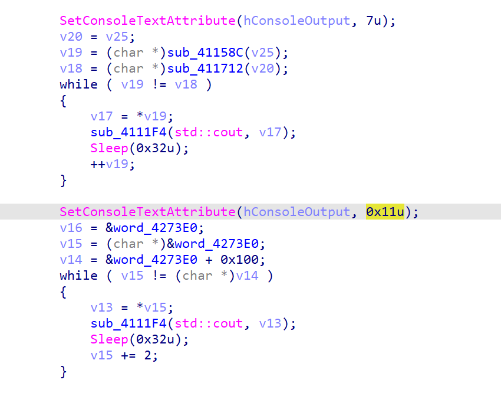
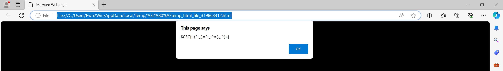
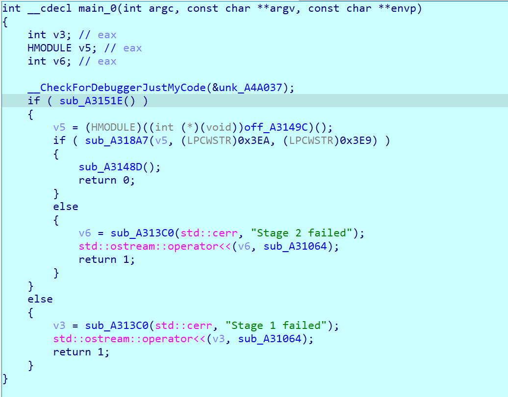
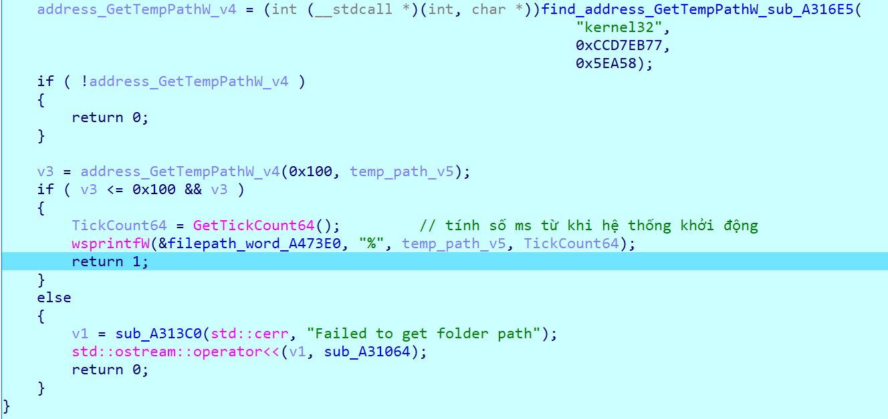
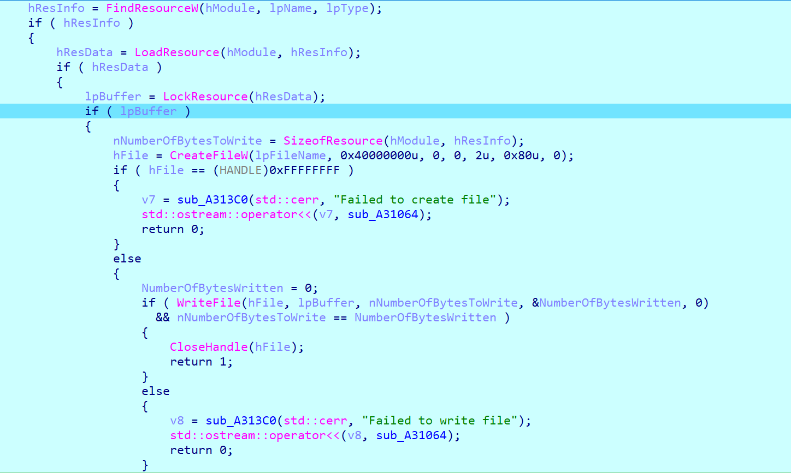
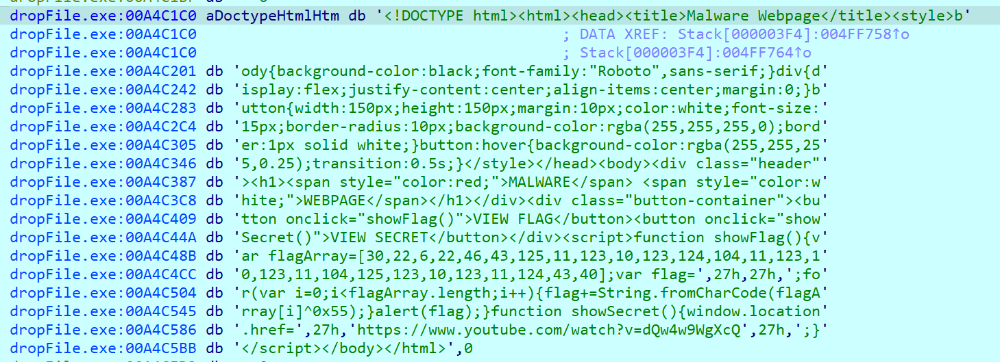
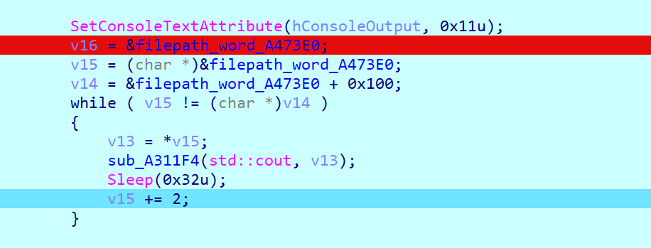

# hide and seek

**Category:** Reverse

**Level:** Easy
<!-- **Solves:** 23 -->

**Description:** I hid a little surprise for you somewhere in your computer. Let's see if you can find it!

**File:** [rev_hide_and_seek](./_/rev_hide_and_seek.rar)

**Challenge** 

# Writeup

## Cách 1
Nhận thấy, mặc dù chữ đã bị bôi xanh nhưng chúng ta vẫn có thể copy text được. Từ đó, ta dễ dàng có được flag. 



## Cách 2

Do mình thấy chương trình có dòng code
```cpp
SetConsoleTextAttribute(hConsoleOutput, 7u);
```
nên mình nghĩ đây là hàm thay đổi màu chữ. Từ đó mình patch lại màu chữ từ 0x11 thành 0x7 cho giống các đoạn text có thể nhìn được ở trên



Lưu lại chương trình và chạy lại. Ta có được file chứa flag nằm tại `C:\Users\Pwn2Win\AppData\Local\Temp\.temp_html_file_428643812.html`



Flag là **KCSC{~(^._.)=^._.^=(._.^)~}** (Markdown render text bị lỗi)

## Cách 3

Mình sẽ debug chương trình để xem nó thực sự hoạt động như thế nào. 

Ta sẽ đi phân tích hàm `main` với các hàm quan trọng như sau: 
- sub_A3151E
- sub_A318A7
- sub_A3148D



### 1. Phân tích sub_A3151E $\to$ sub_A3151E $\to$ sub_A388A0

Hàm `sub_A316E5` tìm địa chỉ của hàm `GetTempPathW` trong `kernel32.dll` rồi lưu vào `v4`. 

Đoạn `v3 = v4(0x100, v5)` nhằm lưu đường dẫn `%temp%` vào biến `v5`, rồi trả về độ dài đường dẫn tại `v3`.



Hàm `GetTickCount64` trả về số ms từ khi hệ thống khởi động. Mục đích nhằm mỗi lần chạy file thực thi sẽ tạo ra một file khác nhau. 

Tại `wsprintfW(&filepath_word_A473E0, "%", temp_path_v5, TickCount64);`, `filepath` được lưu tại `word_A473E0` với cấu trúc như sau 

`filepath` = `%temp%` + chuỗi `.temp_html_file` + chuỗi `TickCount64` + đuôi `.html`

Vậy, nhiệm vụ hàm `sub_A388A0` là tạo một filepath trong `%temp%`. 

### 2. Phân tích sub_A318A7 $\to$ sub_A37A70

Chương trình lần lượt `FindResourceW` $\to$ `LoadResource` $\to$ `LockResource`



Kiểm tra `resources`, ta thấy data là một html code.  



Cuối cùng, chương trình tạo một file với đường dẫn đã tạo tại `sub_A3151E`, rồi ghi dữ liệu phía trên vào. 

### 3. Phân tích sub_A3148D $\to$ sub_A3FCD0

Tại hàm này, ta chỉ quan tâm đến đoạn mã in ra màn hình console. Đặt breakpoint tại đoạn mã in `filepath`, thấy rằng dữ liệu không có bất cứ thay đổi nào. 



Vậy, chúng ta đã có thể giải quyết bằng nhiều cách khác nhau. Cảm ơn tác giả đã tạo ra một challenge basic nhưng writeup rất chất lượng. 

# Tham khảo
- https://github.com/scrymastic/CTFs/blob/main/KCSC-Recruitment-2023/hide%20and%20seek/wu/hide_and_seek.md
