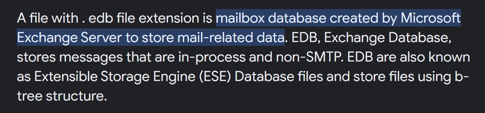
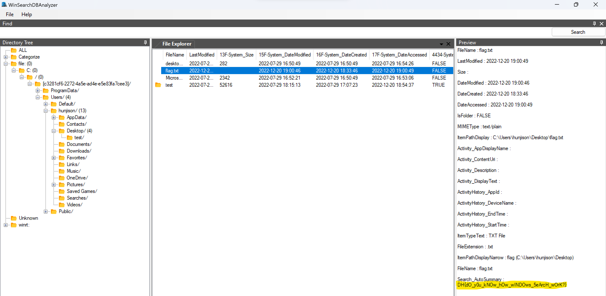

# Solve

File `edb` là file mailbox database chứa dữ liệu liên quan tới thư, được tạo bởi Microsoft Exchange Server. Để giải quyết bài toán này, mình sử dụng công cụ [WinSearchDBAnalyzer](https://github.com/moaistory/WinSearchDBAnalyzer). 

Sau một hồi cài đặt và tìm kiếm các thư mục thông dụng. Mình phát hiện flag nằm ở `C:\Users\hunjison\Desktop\flag.txt`
