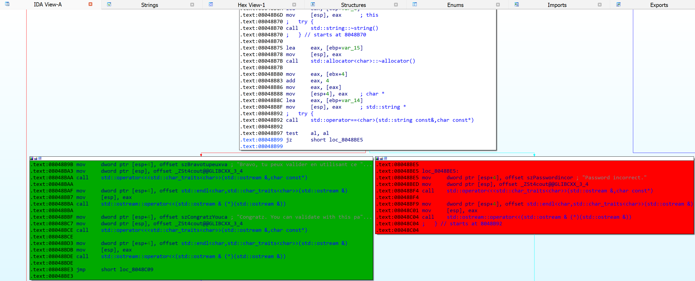
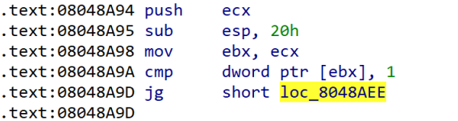
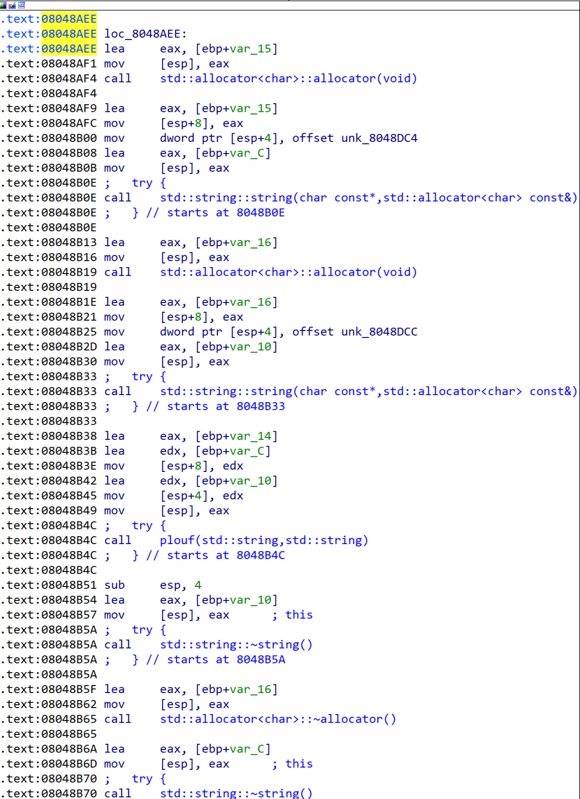
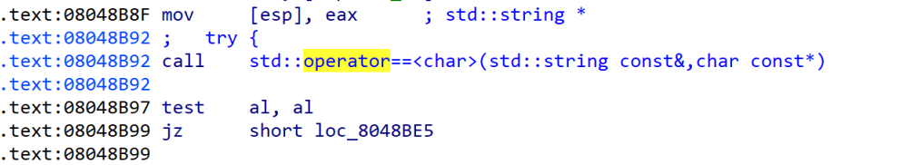
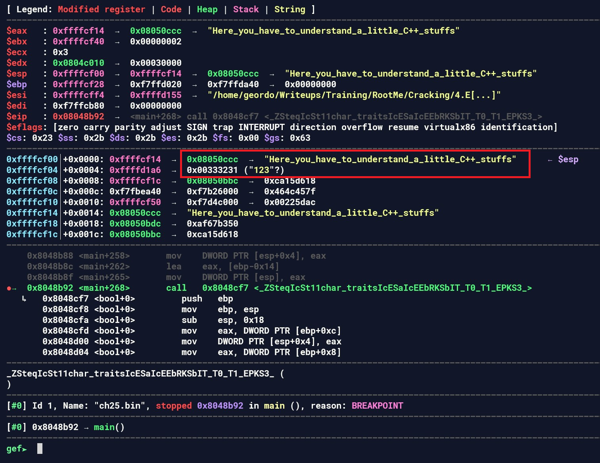
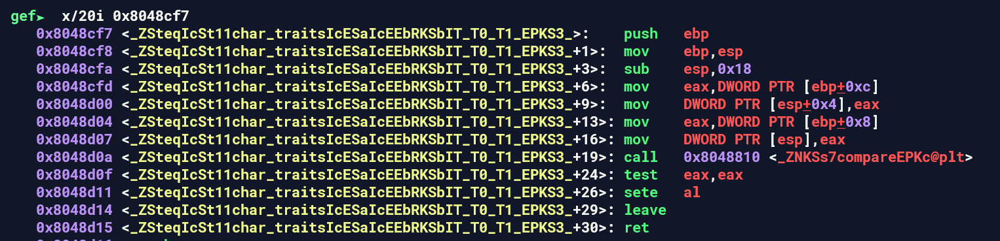
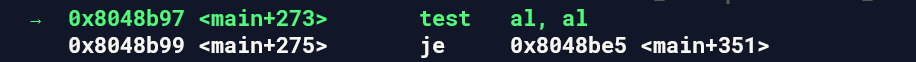

Bài này viết bằng C++, ngại reverse quá. 

Dựa vào các chuỗi kết quả khi chạy thử chương trình. Mình trace ngược lại, đổi màu các nhánh như sau 

Vì là một bài basic, nếu F5 ra mã giả thì ai cũng làm được. Nhưng vì đang luyện tập, nên mình ráng đọc mã asm và debug để giải bài này luôn (thực ra F5 cũng không có được). 

Đoạn code này, chương trình kiểm tra xem chúng ta có nhập đủ 2 tham số hay không, trong đó, tham số đầu tiên là tên file. 

Đến đoạn code tại `0x08048AEE`, thực sự mình không hiểu chương trình đang làm cái gì. Nhưng mình thấy rằng, đoạn code này không có những lệnh như `cmp`, `test` và các lệnh có công dụng so sánh. Vì vậy mình dùng `gdb` để thử debug. 

Trong IDA, ta nên chú ý những dòng code cuối cùng. 

Còn trong gdb, khi mình chạy đến đây thấy trên stack có 2 chuỗi, đó là "123", đây là chuỗi mình nhập vào. Chuỗi còn lại là "Here_you_have_to_understand_a_little_C++_stuffs". Tới đây, mình đoán chuỗi đấy này là flag 

Vì tò mò, mình xem tiếp chương trình so sánh 2 chuỗi kiểu gì 

Thực ra không có gì lạ cả. Mình chỉ biết thêm `sete al` là lật ngược lại giá trị của thanh ghi `al` thôi. Xong đoạn check này, `eax = 0`. Quay về hàm main, chương trình `test al, al` và nhảy tới nhánh sai nếu `al = 0`. 

