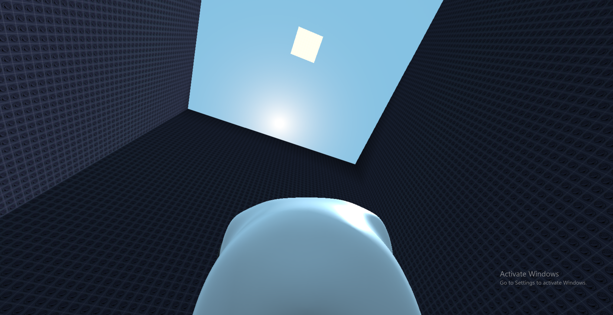
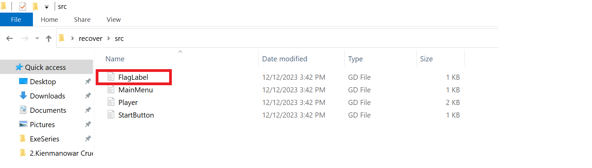

Đây là một game được code bằng Godot. Dựa vào description 
> Your developer friend has designed a new game that he wants you to test. He explains that the goal is to reach the island of light in the sky. He also tells you that if you ever get there, you have to tell him what is written on the sign on the island as proof, because it is impossible for you to get there. Show him that he is wrong.

và chơi thử game, ta biết được rằng, để lấy được flag sẽ phải nhảy lên ô trắng ở trên trời kia. 



Điều này là không thể. Từ đây, ta có một số ý tưởng để giải thử thách này. 
- Đổi tọa độ của mình đang đứng
- Thay đổi độ cao mình có thể nhảy được hoặc disable việc rớt xuống đất
- Dùng tool để decompile chương trình 

Với 2 ý tưởng trên, do chưa có kinh nghiệm về dịch ngược game nên mình tạm gác lại. Tới đây, mình dùng công cụ gdsdecomp(https://github.com/bruvzg/gdsdecomp) để dịch ngược chương trình. Kết quả thu được khá khả quan.  



Đây là đoạn code của FlagLabel.gd
```go
extends Label

func _ready():
	var key = [119, 104, 52, 116, 52, 114, 51, 121, 48, 117, 100, 48, 49, 110, 103, 63]
	var enc = [32, 13, 88, 24, 20, 22, 92, 23, 85, 89, 68, 68, 89, 11, 71, 89, 27, 9, 83, 84, 93, 1, 57, 42, 83, 7, 13, 96, 69, 29, 86, 81, 52, 4, 7, 64, 70]
	
	text = ""
	for i in range(len(enc)):
		text += char(enc[i] ^ key[i % len(key)])

```

Dễ thấy, đây chỉ là đoạn xor giữa `key` và `enc`. Mình sửa lại một chút ở đoạn code này và có được flag. 

```python
key = [119, 104, 52, 116, 52, 114, 51, 121, 48, 117, 100, 48, 49, 110, 103, 63]
enc = [32, 13, 88, 24, 20, 22, 92, 23, 85, 89, 68, 68, 89, 11, 71, 89, 27, 9, 83, 84, 93, 1, 57, 42, 83, 7, 13, 96, 69, 29, 86, 81, 52, 4, 7, 64, 70]
	
text = ""
for i in range(len(enc)):
    text += chr(enc[i] ^ key[i % len(key)])

print(text)
```

Flag là **ScriPts1nCl34r**

Mình nghĩ cách giải này chỉ đúng với những bài basic, tác giả cố tình thêm đoạn mã hóa trên vào bài toán làm bài toán dễ hơn rất nhiều. Mình sẽ viết tiếp bài giải cho bài này bằng các ý tưởng ban đầu của mình. 