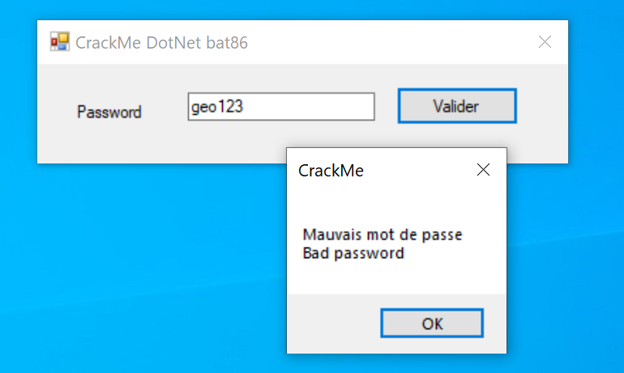
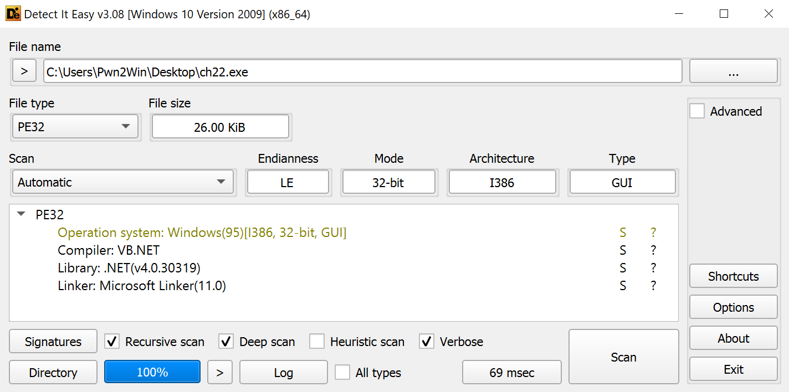
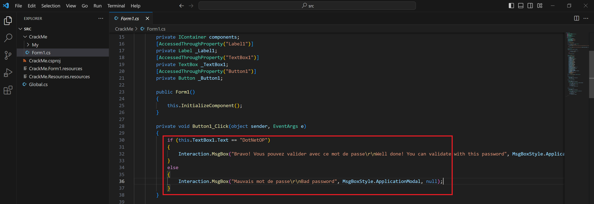

Chạy thử chương trình, chúng ta nhận thấy đây là một bài nhập password quen thuộc. 

Kiểm tra thông tin file bằng công cụ "Detect It Easy". Ta thấy đây là một file PE 32, được viết bằng .NET. 

Từ [resource](https://www.go4expert.com/articles/introduction-cracking-part-i-t17368) đã cho, mình liền download và thử sử dụng công cụ [.NET Reflector](https://www.red-gate.com/products/reflector/) để decompile .NET app. 

Mình decompile chương trình rồi export source code ra. 
 

Tìm tòi một hồi các file vừa thu được, mình thấy có đoạn check này, chắc chắn là đoạn check input mình nhập vào. 

Vậy flag là **DotNetOP**