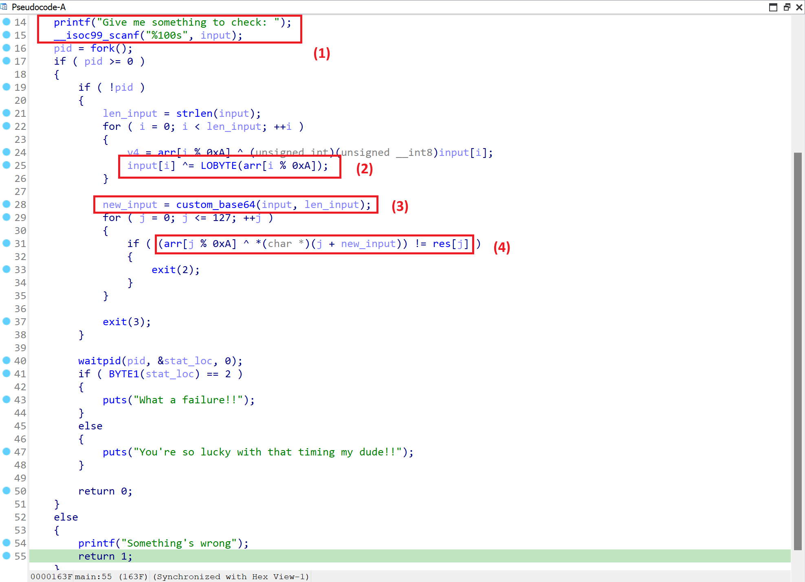
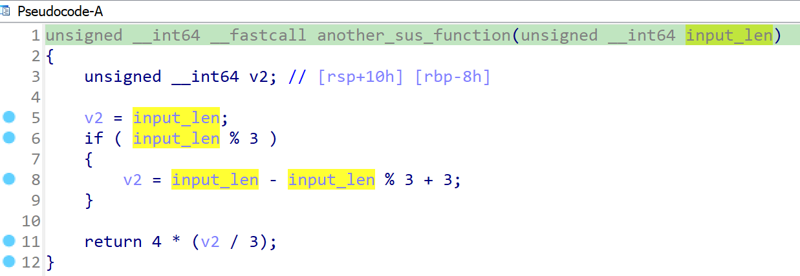
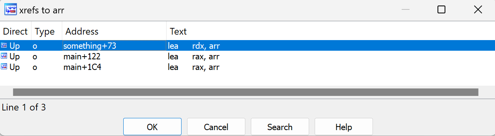
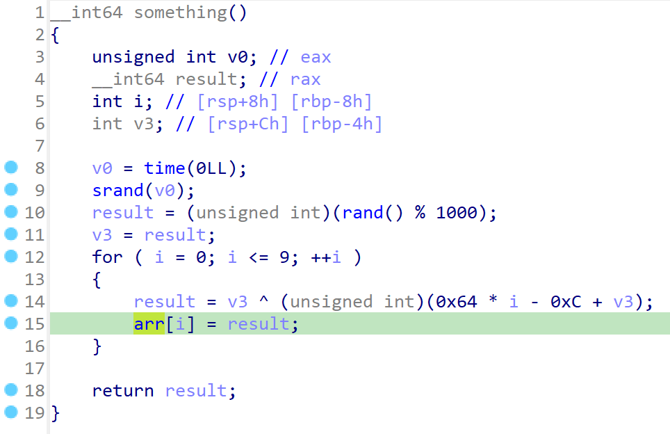
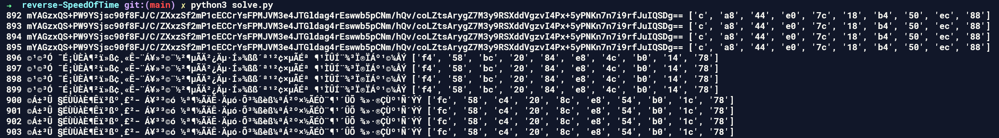

Kiểm tra chương trình, đây là một file ELF 64 bit. Dùng IDA để decompile chương trình, dưới đây chính là mã giả sau khi decompile. 



Một số nhận xét của mình về chương trình như sau 
1. Block (1) cho chúng ta nhập đầu vào, mình tạm gọi là `input`
2. Tại block (2), chương trình xor `input` với `arr`. Độ dài mảng `arr` là 10 bytes. 
3. Sau khi phân tích tại block (3), mình đoán đây chính là một hàm `custom_base64`. Input ban đầu của mình sau khi qua hàm này sẽ thành một input mới, mình tạm gọi là `new_input`
4. Tiếp tục đem xor `new_input` với `arr` rồi so sánh kết quả với `res`. 

Tóm lại `custom_base64(input ^ arr) ^ arr == res`

Một số lý do để mình có nhận xét thứ 3 đó là 
1. Hàm này gọi hàm `another_sus_function` rất quen thuộc với việc mã hóa base64 

2. Bảng alphabet được custom lại chứa tại `chars[] = "0123456789abcdefghijklmnopqrstuvwxyzABCDEFGHIJKLMNOPQRSTUVWXYZ+/"`
3. Đặt breakpoint tại hàm `custom_base64`. Thấy rằng, với `input = "abcdefghik123"`, hàm sẽ trả về `rgGDhfCucZx5UPRqZM==`, một đặc trưng của mã hóa base64. 

Quay lại bài toán, nhìn vào công thức đã rút ra được ở trên. Với việc đã có giá trị `res`, chỉ cần có được giá trị `arr` là có thể giải được bài này. 

> Lần đầu tiên làm bài này, mình đã sai, do ngỡ `arr` là giá trị mặc định. 

Tham chiếu `arr`, ta thấy hàm `something` đang tạo ra giá trị cho mảng `arr`. 



Hàm `something` tạo mảng `arr` với việc lấy một giá trị random trong khoảng [0, 999]. Từ đó tính các giá trị cho mảng `arr`. 



Với việc khoảng giá trị random rất nhỏ, ta sẽ bruteforce để tìm mảng `arr`. 

Đây là đoạn script mình lấy tất cả giá trị của mảng `arr`, đồng thời tính luôn `input` sau khi xor lần đầu tiên. 

```python
# r = ["61","0F1","705","7A7","606","660","6E5","503","5C7","5D8","5B"
#         ,"91","71D","7B3","616","66B","6D7","569","5DC","5EE","34","0EE"
#         ,"70E","7CF","63F","637","6EE","508","594","5F2","5F","0CE","776"
#         ,"78D","62C","629","6D7","515","5AF","5CB","7E","0F1","737","7A6"
#         ,"62C","655","6FE","506","5A1","5BB","69","9C","70E","7B4","63B"
#         ,"674","6D0","531","58B","5BC","7E","0ED","737","797","60B","67A"
#         ,"681","520","5AF","5C6","61","87","72C","7B1","60A","637","6D7"
#         ,"53F","5A0","5D2","78","0DB","705","792","605","67F","6EE","567"
#         ,"5A1","5BB","75","91","716","7B3","624","67C","6D0","506","58B"
#         ,"5F2","7A","0E1","770","7B0","604","633","681","529","5BC","5C6"
#         ,"47","0C6","773","78E","64B","671","68D","522","58A","5C2","79"
#         ,"0E1","715","7B3","638","67F","689","56D"]

# res = [int(i, 16) for i in r]
res = [97, 241, 1797, 1959, 1542, 1632, 1765, 1283, 1479, 1496, 91, 145, 1821, 1971, 1558, 1643, 1751, 1385, 1500, 1518, 52, 238, 1806,     1999, 1599, 1591, 1774, 1288, 1428, 1522, 95, 206, 1910, 1933, 1580, 1577, 1751, 1301, 1455, 1483, 126, 241, 1847, 1958, 1580, 1621, 1790, 1286, 1441, 1467, 105, 156, 1806, 1972, 1595, 1652, 1744, 1329, 1419, 1468, 126, 237, 1847, 1943, 1547, 1658, 1665, 1312, 1455, 1478, 97, 135, 1836, 1969, 1546, 1591, 1751, 1343, 1440, 1490, 120, 219, 1797, 1938, 1541, 1663, 1774, 1383, 1441, 1467, 117, 145, 1814, 1971, 1572, 1660, 1744, 1286, 1419, 1522, 122, 225, 1904, 1968, 1540, 1587, 1665, 1321, 1468, 1478, 71, 198, 1907, 1934, 1611, 1649, 1677, 1314, 1418, 1474, 121, 225, 1813, 1971, 1592, 1663, 1673, 1389]

for i in range(1000):
    k = i 
    key = [0] * 10
    for j in range(10): 
        key[j] = k ^ (0x64 * j - 0xC + k)

    flag = 1 
    base64 = [0] * 128
    for j in range(128):
        base64[j] = key[j % 10] ^ res[j]
        if not (0 <= base64[j] <= 255):
            flag = 0 
            break
    
    if flag == 1:
        print(i, ''.join([chr(i) for i in base64]), ([hex(i & 0xff)[2:] for i in key]))

    else:
        continue
```

Kết quả thu được là 



Từ những giá trị thu được ở trên, mình chỉ cần xor thêm một lần nữa là lấy được flag. 

```python
x = [91, 201, 42, 142, 29, 54, 251, 62, 137, 243, 100, 220, 48, 144, 15, 34, 155, 127, 155, 255, 123, 134, 61, 143, 9, 108, 193, 50, 137, 166, 111, 199, 41, 207, 11, 121, 192, 51, 132, 183, 122, 149, 52, 164, 4, 110, 135, 32, 128, 177, 89, 155, 21, 191, 71, 71, 255, 49, 139, 253, 117, 201, 27, 137, 15, 71, 192, 56, 137, 215, 110, 205, 55, 148, 35, 126, 193, 51, 135, 225, 98, 207, 27, 151, 29, 113, 210, 37, 179, 237, 122, 205, 54, 157]
k = [12, 168, 68, 224, 124, 24, 180, 80, 236, 136]

flag = ''
for i in range(len(x)): 
    flag += chr(k[i % 10] ^ x[i])

print(flag)
```

Flag là **Wanna.One{https://www.youtube.com/watch?v=pDxv3pl9U3Q_;_Kaguya_is_the_best_fucking_waifu_ever}**