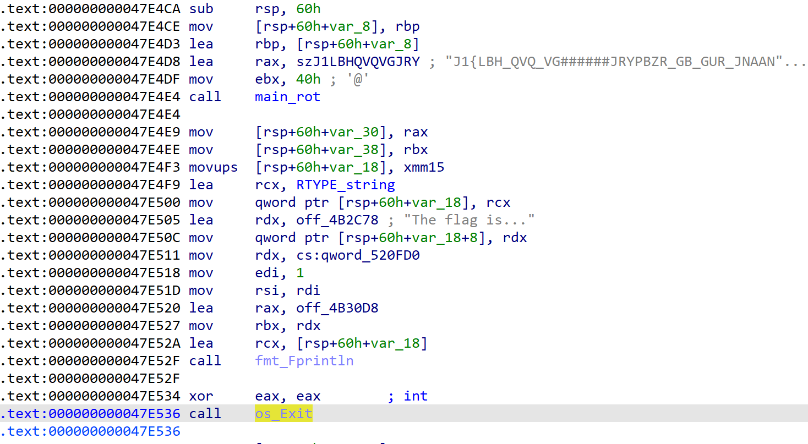
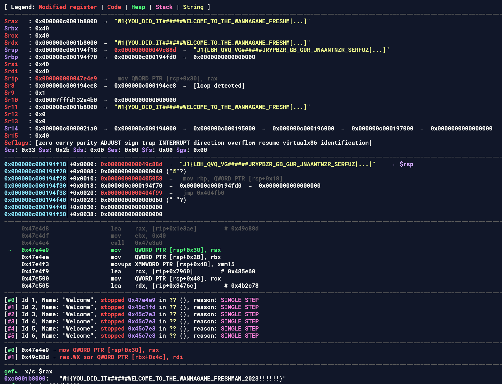

Sử dụng IDAPRO để disassembly chương trình, ta thấy chương trình có một chuỗi kí tự khả nghi `szJ1LBHQVQVGJRY = 'J1{LBH_QVQ_VG######JRYPBZR_GB_GUR_JNAANTNZR_SERFUZNA_2023!!!!!'`

Để giải quyết bài này, mình có một số hướng đi như sau 
1. Decode chuỗi kí tự ở trên, khả năng cao sẽ là ROT. 
2. Debug động để quan sát kết quả thu được sau khi gọi hàm `main_rot`
3. Chương trình có gọi hàm `os_Exit`. Mình sẽ patch thành lệnh `nop` để cho chương trình tiếp tục thực thi. 

Đối với bài này, mình sử dụng phương pháp thứ 2 để giải. Kết quả thu được như sau 

Flag là **W1{YOU_DID_IT######WELCOME_TO_THE_WANNAGAME_FRESHMAN_2023!!!!!!}**