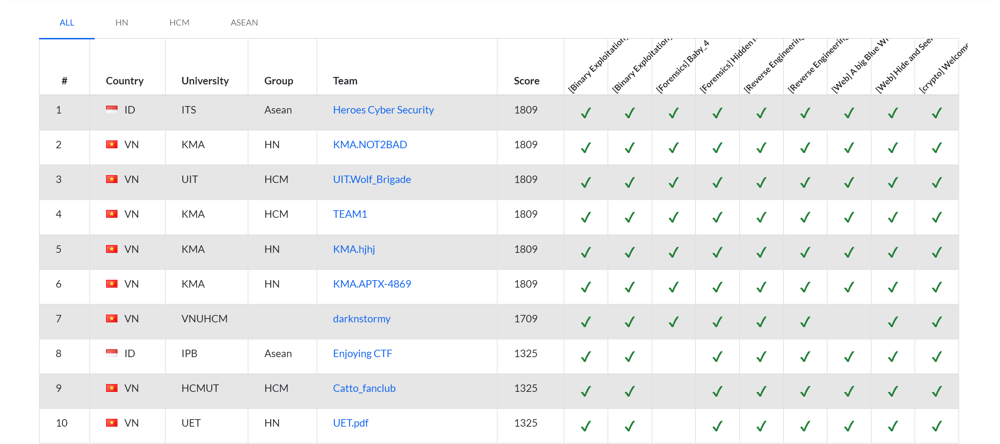
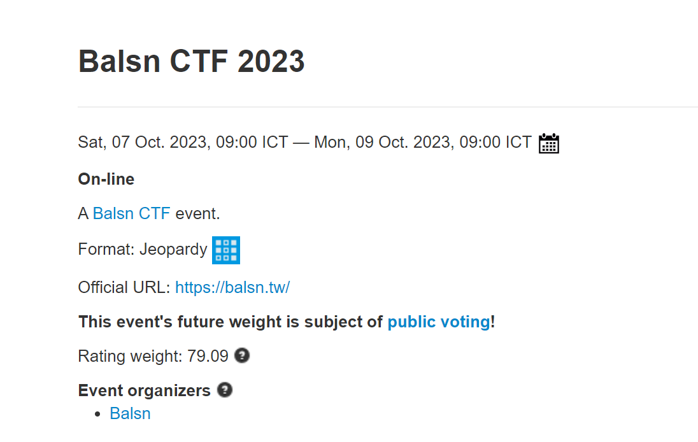
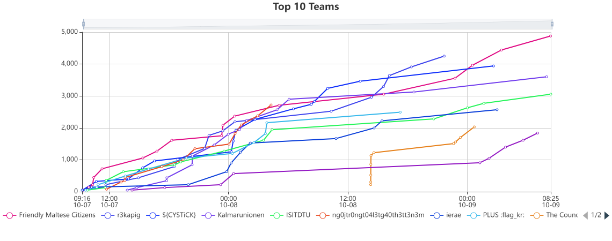
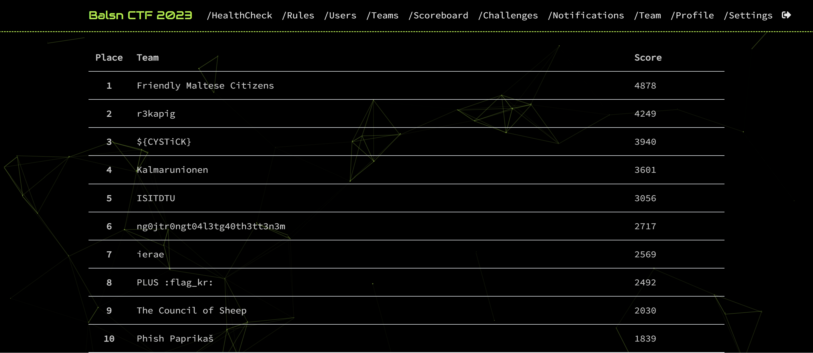

# Khởi động SVATTT 2023 

Tuần vừa rồi vừa diễn ra vòng khởi động SVATTT 2023. Vòng này sẽ tuyển chọn 3 đội mạnh nhất của các trường đại học để vào thi vòng sơ khảo. 



Top 10 như các bạn thấy trên ảnh bao gồm 2 đội của Indonesia, 3 đội KMA miền Bắc, 1 đội KMA miền Nam, UET, UIT, VNU và HCMUT. 
Trong 10 đội dẫn đầu, chỉ có 6 đội giải được hết tất cả 9 bài của vòng này. Bài khó nhất có lẽ là bài forensics `Baby_4` với chỉ 11 đội giải được, sau đó là bài reverse `Oxygen` với 12 lượt submit thành công.   

Hai bài pwn được coi là vô cùng dễ là `pwn1` với `pwn2` được các đội giải quyết vô cùng nhanh chóng. 

Bài `pwn1` với ý tưởng là sử dụng bug ở hàm `scanf(%s)` để ghi đè giá trị các biến trên stack rồi `ret2win` sẽ lấy được flag. 
Bài `pwn2` còn dễ hơn khi chỉ cần lên mạng tìm shellcode với độ dài lớn hơn 39 bytes là có được shell. 

Vòng sơ khảo sẽ được tổ chức vào cuối tháng 10 này tại PTIT nếu các bạn ở miền Bắc, còn các bạn ở miền Nam sẽ thi tại HUTECH. 

# BalsnCTF 

Cuối tuần qua cũng vừa diễn ra cuộc thi BalsnCTF, một trong những cuộc thi có rating cao top đầu trên ctftime với 79.09 điểm.



Với đề thi vô cùng khó như vậy, thật bất ngờ khi trong top 10 có sự góp mặt của 3 team Việt Nam đó là: ISITDTU (rank 5), ng0jtr0ngt04l3tg40th3tt3n3m (rank 6) và The Council of Sheep (rank 9)




Bài pwn được coi là dễ nhất đề `BabyPwn2023` nhìn rất dễ nhưng lại vô cùng khó. Dưới đây là mã giả của bài này 

```c
int __cdecl main(int argc, const char **argv, const char **envp)
{
  char v4[32]; // [rsp+0h] [rbp-20h] BYREF

  setvbuf(_bss_start, 0LL, 2, 0LL);
  gets(v4);
  puts("Baby PWN 2023 :)");
  return 0;
}
```

Với các bạn đã từng tryhard trên pwnable.tw thì có thể sẽ nhận ra, bài này khá giống bài `De-ASLR` với 500PTS. Đúng là khá baby, nhưng chỉ baby cho những người chơi pwn giỏi. 